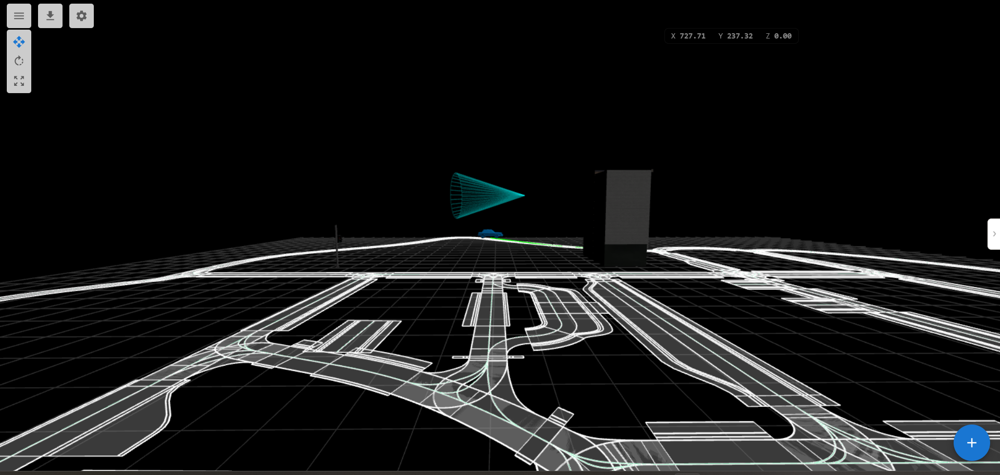
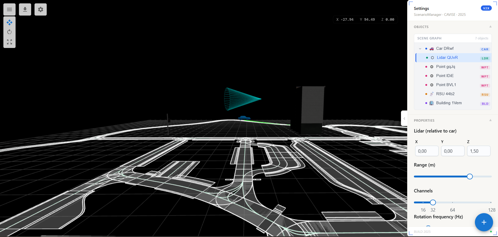
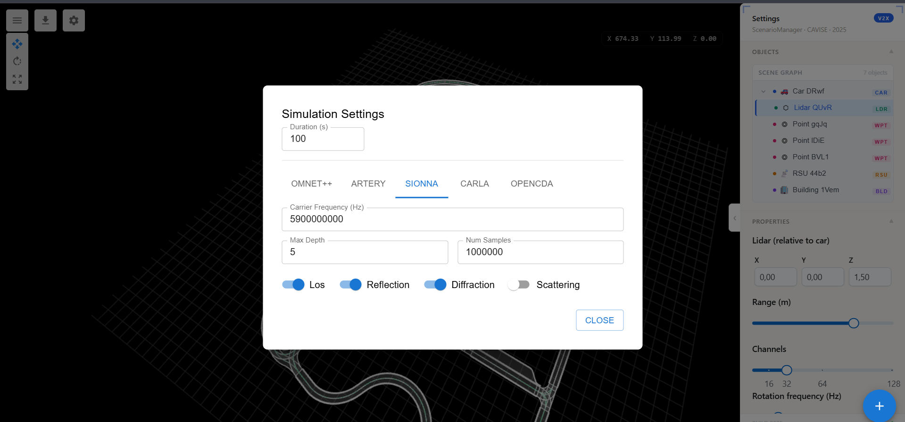
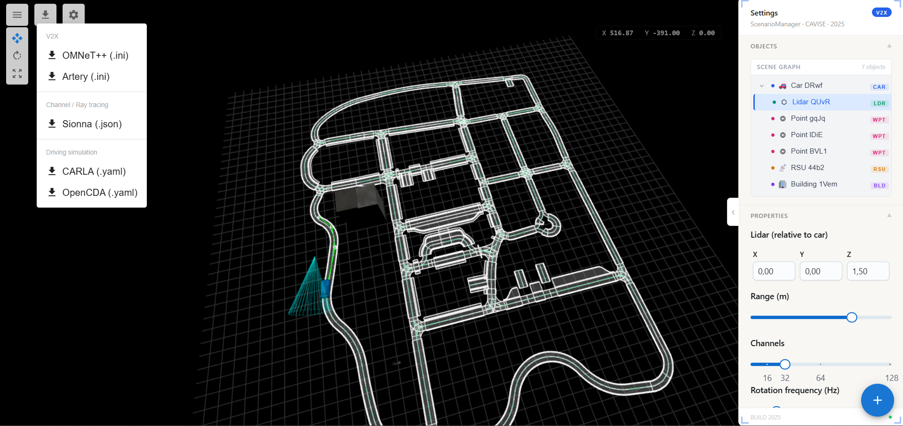

# ScenarioManager · CAVISE

> **A real-time 3D scenario editor for V2X (Vehicle-to-Everything) simulation environments.**
> Built for engineers working on autonomous driving and smart infrastructure research.

---

## Screenshots


*OpenDRIVE road network with a vehicle equipped with LiDAR sensor and route waypoint*


*Scene Graph tree with object hierarchy and LiDAR property editor*


*Per-simulator configuration dialog — SIONNA ray tracing parameters shown*


*Export menu — generate config files for OMNeT++, Artery, Sionna, CARLA, and OpenCDA*

---

## Overview

ScenarioManager is a browser-based 3D scene editor built on top of [OpenDRIVE](https://www.asam.net/standards/detail/opendrive/) road network maps. It lets you place and configure vehicles, RSU (Road Side Units), LiDAR sensors, buildings, and route waypoints — then export scenarios directly to [OpenCDA](https://github.com/ucla-mobility/OpenCDA) for simulation.

The editor features a live scene graph panel, per-object property editing, transform controls, and real-time telemetry monitoring.

---

## Features

- **OpenDRIVE map loading** — parse and render `.xodr` road network files via WebAssembly
- **3D scene editing** — place, move, rotate, and scale objects directly in the viewport
- **Vehicle management** — add cars with configurable color, speed, and route waypoints
- **RSU placement** — deploy Road Side Units with protocol, TX power, and range settings
- **LiDAR sensors** — attach configurable LiDAR sensors to vehicles with range visualization
- **Building placement** — populate the scene with 3D building assets
- **Route planning** — define per-vehicle waypoint paths with visual connectors
- **Scene Graph panel** — hierarchical object tree with live position readout and type badges
- **Scenario save/load** — persist and restore full scene state including all objects and routes
- **Simulation launch** — send scenarios directly to an OpenCDA backend via REST API
- **Telemetry modal** — monitor live simulation data in real time

---

## Tech Stack

| Layer | Technology |
|---|---|
| Framework | React 18 + TypeScript |
| 3D Engine | Three.js |
| Road Network | OpenDRIVE (via WebAssembly) |
| State Management | Zustand |
| UI Components | MUI Joy + MUI X Tree View |
| Build Tool | Vite |
| 3D Utilities | three-stdlib (TransformControls, GLTFLoader) |

---

## Getting Started

### Prerequisites

- Node.js 18+
- A `.xodr` road network file (place at `public/data.xodr`)

### Install

```bash
npm install
```

### Run

```bash
npm run dev
```

Open [http://localhost:5173](http://localhost:5173) in your browser.

### Build

```bash
npm run build
```

---

## Docker

The frontend can be run via Docker Compose using profiles.

### Production

```bash
docker compose --profile prod up
```

Builds and serves the production bundle.

### Development

```bash
docker compose --profile frontend-dev up
```

Starts the Vite dev server with hot reload.

```bash
docker compose --profile dev up
```

Starts the full development stack (frontend + backend services).

### Common Commands

```bash
# Run in background
docker compose --profile prod up -d

# Stop all containers
docker compose down

# Rebuild after dependency changes
docker compose --profile prod up --build

# View logs
docker compose logs -f
```

---

## Project Structure

```
src/
├── pages/
│   ├── Editor.tsx                  # Main editor entry point
│   └── Editor/
│       ├── hooks/
│       │   ├── useThreeScene.ts    # Three.js scene setup and lifecycle
│       │   ├── useMouseEvents.ts   # Raycasting and interaction handlers
│       │   ├── useSceneGraph.ts    # Scene tree traversal and state
│       │   ├── useCarMeshSync.ts   # Vehicle mesh synchronization
│       │   ├── useLidarMeshSync.ts # LiDAR mesh synchronization
│       │   ├── useRSUMeshSync.ts   # RSU mesh synchronization
│       │   └── useScenarioSave.ts  # Scenario serialization
│       ├── scene/
│       │   ├── loadRSU.ts          # RSU model loading
│       │   └── loadPoints.ts       # Waypoint circle rendering
│       └── components/
│           ├── CoordinateWidget    # Live camera/road coordinates
│           ├── EditorToolbar       # Top toolbar actions
│           └── EditorTransformControls # Transform mode switcher
├── components/
│   └── Statuses/
│       └── RightPanel/             # Settings panel
│           ├── components/
│           │   ├── SceneTreePanel  # Scene graph tree view
│           │   ├── CarProperties   # Vehicle property editor
│           │   ├── RSUProperties   # RSU property editor
│           │   ├── LidarProperties # LiDAR property editor
│           │   ├── BuildingProperties
│           │   └── RoutePointProperties
│           └── ui/index.tsx        # Panel layout
└── store/
    └── useEditorStore.ts           # Global Zustand store
```

---

## Usage

### Adding Objects

Use the speed dial button (bottom-right corner) to add objects to the scene:

| Action | Description |
|---|---|
| **Add Car** | Click to enter car placement mode, then click on the road |
| **Add RSU** | Double-click on the road or open space to place an RSU |
| **Add Building** | Click to enter building mode, then double-click to place |
| **Add Route Points** | Select a car first, then use Add Points to define its route |

### Selecting & Editing

- **Click** any object in the viewport to select it and open its properties in the right panel
- **Click** any object in the Scene Graph tree to select it and attach transform controls
- Use the **transform toolbar** (top-left) to switch between Translate / Rotate / Scale modes
- Press **Escape** to deselect and save current transforms
- Press **Delete** to remove the selected object

### Saving & Simulation

- Click **Save** in the toolbar to persist the scenario to localStorage
- Click **Run Simulation** to send the scenario to the OpenCDA backend
- The backend URL is configured via the `PORT` constant in `src/VARS.ts`

---

## Configuration

```ts
// src/VARS.ts
export const PORT = 5000; // OpenCDA backend port
```

---

## Backend API

ScenarioManager communicates with an OpenCDA backend over HTTP:

```
POST /api/start_opencda
Content-Type: application/json

{
  "scenario_id": "string",
  "scenario_name": "string",
  "weather": "HardRainNoon | ClearNoon | ...",
  "scenario": [
    {
      "path": [{ "x": 0, "y": 0, "z": 0 }],
      "vehicle": "mercedes.coupe_2020",
      "color": { "r": 127, "g": 0, "b": 0 },
      "active": false
    }
  ]
}
```

---

## Object Types

| Type | userData.type | Description |
|---|---|---|
| Vehicle | `car` | Autonomous vehicle with route and LiDAR |
| RSU | `point` | Road Side Unit (V2X infrastructure node) |
| LiDAR | `lidar` | Sensor attached to a vehicle |
| Building | `building` | Static environment asset |
| Waypoint | `circle` | Route point belonging to a vehicle |

---

## Exporting Configs

Once your scenario is set up in the editor, click the **download icon** in the toolbar to open the export menu. Configs are generated from the current scene state — vehicles, RSUs, routes, LiDAR sensors, and simulation parameters.

### Supported Simulators

| Category | Simulator | Format | Description |
|---|---|---|---|
| V2X | **OMNeT++** | `.ini` | Network simulation config with RSU positions and vehicle routes |
| V2X | **Artery** | `.ini` | Artery V2X framework config derived from OMNeT++ |
| Channel / Ray tracing | **Sionna** | `.json` | Ray tracing config with carrier frequency, depth, samples, and propagation flags |
| Driving simulation | **CARLA** | `.yaml` | CARLA scenario with vehicle spawns, routes, and sensor definitions |
| Driving simulation | **OpenCDA** | `.yaml` | OpenCDA cooperative driving scenario |

### Simulation Settings Dialog

Before exporting, configure per-simulator parameters via **Settings → Simulation Settings**:

**General**
- `Duration (s)` — total simulation time in seconds

**SIONNA** (Channel / Ray tracing)
- `Carrier Frequency (Hz)` — e.g. `5900000000` for 5.9 GHz DSRC
- `Max Depth` — maximum number of ray interactions (reflections + diffractions)
- `Num Samples` — number of ray paths to compute
- `LoS` — enable Line-of-Sight propagation
- `Reflection` — enable surface reflections
- `Diffraction` — enable edge diffraction
- `Scattering` — enable diffuse scattering

**CARLA / OpenCDA**
- Vehicle models, colors, and routes are taken directly from the scene
- LiDAR sensors are exported with their position, range, channels, and rotation frequency

### Workflow

```
1. Load .xodr map
2. Place vehicles, RSUs, buildings
3. Define vehicle routes (waypoints)
4. Attach LiDAR sensors to vehicles
5. Open Settings → configure simulation parameters
6. Click Export → choose target simulator
7. Use generated config file with the corresponding simulator
```

---

## License

© 2025 CAVISE. All rights reserved.