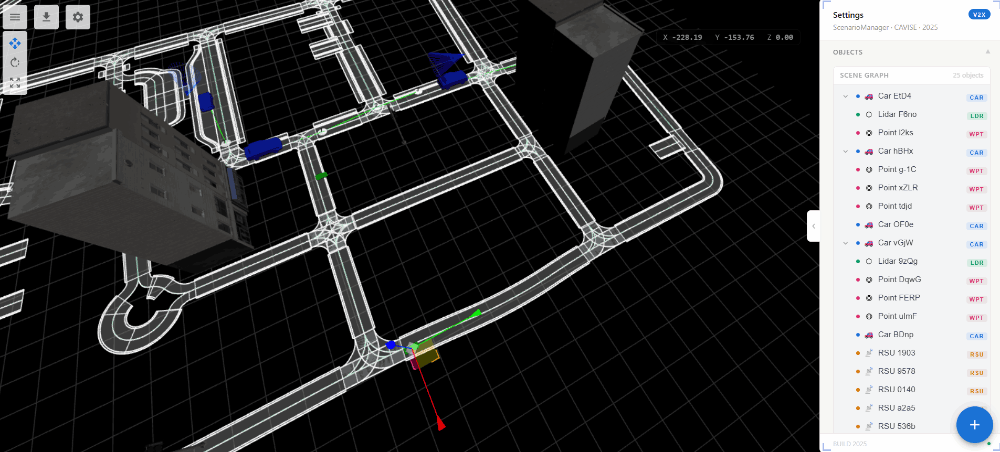
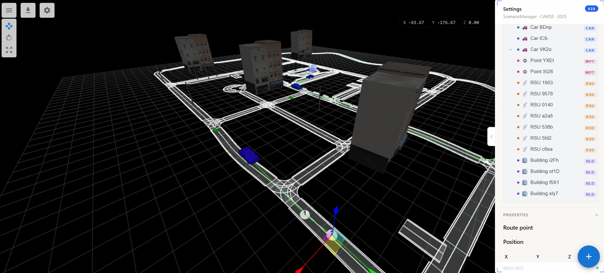
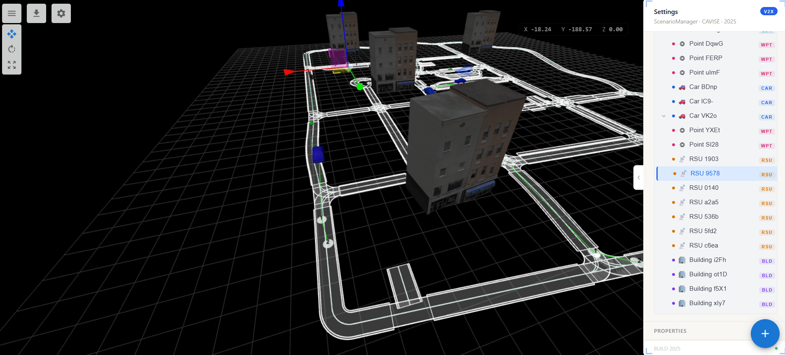
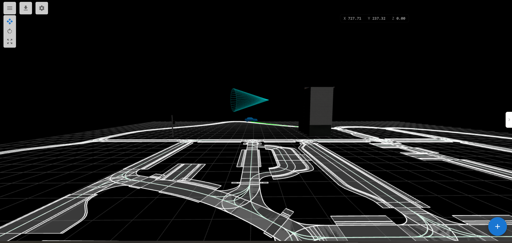
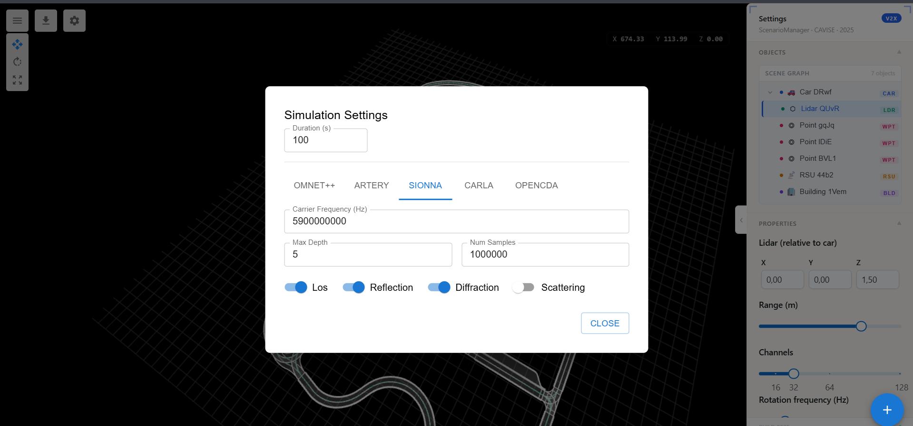
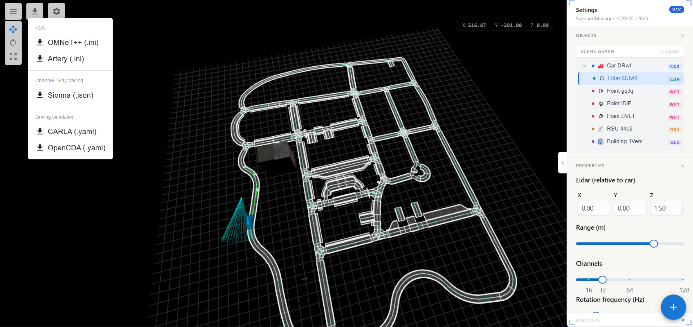

# ScenarioManager | CAVISE

ScenarioManager is a web editor and execution service for connected autonomous
vehicle scenarios. It combines a React editor, a FastAPI backend, PostgreSQL,
CARLA, and the bundled OpenCDA runtime.

## Demo

### Scene Editor



### Scene Graph



### Configuration Export



## Screenshots

| Editor | Object settings |
| --- | --- |
|  |  |
| Simulation settings | Export menu |
|  |  |

## Main Capabilities

- Edit roads, vehicles, RSUs, obstacles, weather, and attack scenarios.
- Validate scenarios before export or simulation.
- Export OpenCDA YAML, OpenSCENARIO, OpenDRIVE, and CARLA Python scripts.
- Start and monitor OpenCDA simulations through REST and WebSocket APIs.
- Store scenarios in PostgreSQL and expose run artifacts through the backend.
- Evaluate routes, collisions, localization, communication, and attack effects.

## Stack

| Area | Technologies |
| --- | --- |
| Frontend | React, TypeScript, Vite, Zustand, MapLibre GL, Three.js |
| Backend | Python, FastAPI, Pydantic, SQLAlchemy, Alembic |
| Simulation | CARLA 0.9.16, OpenCDA, SUMO integration |
| Storage | PostgreSQL 17 |
| Tooling | Docker Compose, uv, Yarn, Vitest, Playwright, pytest, Ruff |

## Prerequisites

- Docker Engine with Docker Compose.
- CARLA 0.9.16 for running simulations.
- Python 3.11 or 3.12 and [uv](https://docs.astral.sh/uv/) for local backend work.
- Node.js 22 with Corepack for local frontend work.

## Quick Start

1. Create the environment file and set a real database password:

   ```bash
   cp .env.example .env
   ```

2. Start CARLA on the host configured by `CARLA_HOST` and `CARLA_PORT`.

3. Build and start the complete system:

   ```bash
   docker compose --profile prod up --build -d
   ```

4. Check service status:

   ```bash
   docker compose ps
   ```

Open the frontend at <http://localhost>, the API at
<http://localhost:8000>, and the OpenAPI documentation at
<http://localhost:8000/docs>.

The backend waits for PostgreSQL and applies Alembic migrations automatically
because Compose sets `RUN_MIGRATIONS=1`.

## System Commands

| Command | Description |
| --- | --- |
| `docker compose --profile prod up --build -d` | Build and start frontend, backend, and PostgreSQL. |
| `docker compose up --build backend` | Start backend and PostgreSQL in the foreground. |
| `docker compose ps` | Show service and health status. |
| `docker compose logs -f backend` | Follow backend and simulation process logs. |
| `docker compose logs -f db` | Follow PostgreSQL logs. |
| `docker compose restart backend` | Restart only the backend service. |
| `docker compose exec backend alembic current` | Show the applied database revision. |
| `docker compose exec backend alembic upgrade head` | Apply all pending migrations manually. |
| `docker compose stop` | Stop services without removing containers. |
| `docker compose down` | Stop and remove service containers. |
| `docker compose down -v` | Also delete database and evaluation volumes. |

Use `curl http://localhost:8000/health` for a direct backend health check.

## Backend Development

Install the core dependencies:

```bash
uv sync
```

Include CARLA and the full simulation stack when needed:

```bash
uv sync --extra simulation
```

| Command | Description |
| --- | --- |
| `uv run pytest tests/backend -q` | Run backend tests. |
| `uv run ruff check app tests migrations main.py` | Run Python lint checks. |
| `uv run alembic upgrade head` | Apply migrations from the local environment. |
| `uv run alembic current` | Show the current database revision. |
| `make dev` | Shortcut for starting backend and PostgreSQL with Compose. |
| `make test` | Shortcut for backend tests. |

Local Alembic commands require a database reachable with the values from
`.env`. The standard Compose database is intentionally available only inside
the Compose network, so migration execution normally happens in the backend
container.

## Frontend Development

Install dependencies and start Vite:

```bash
corepack enable
yarn --cwd frontend install --frozen-lockfile
yarn --cwd frontend dev
```

The development UI is available at <http://localhost:5173>. Set
`VITE_API_URL` in `frontend/.env.development` when the backend is not available
at its default address.

| Command | Description |
| --- | --- |
| `yarn --cwd frontend build` | Build the production frontend. |
| `yarn --cwd frontend test` | Run Vitest once. |
| `yarn --cwd frontend test:watch` | Run Vitest in watch mode. |
| `yarn --cwd frontend test:e2e` | Run Playwright end-to-end tests. |
| `yarn --cwd frontend lint` | Run ESLint. |
| `yarn --cwd frontend lint:css` | Fix Stylelint issues. |
| `yarn --cwd frontend format` | Format frontend files with Prettier. |
| `make frontend` | Shortcut for the Vite development server. |
| `make frontend-test` | Shortcut for frontend tests. |

## Configuration

The backend loads `.env` through `pydantic-settings` and `python-dotenv`.
Compose also passes this file to the backend with `env_file` and refuses to
start PostgreSQL when the required database values are missing.

| Variable | Purpose | Example |
| --- | --- | --- |
| `DB_NAME` | PostgreSQL database name. | `scenario_manager` |
| `DB_USER` | PostgreSQL user. | `scenario_manager` |
| `DB_PASSWORD` | PostgreSQL password. | `change-me` |
| `DB_HOST` | Compose PostgreSQL service host. | `db` |
| `DB_PORT` | PostgreSQL port inside the Compose network. | `5432` |
| `DB_ENCODING` | Database client encoding. | `UTF8` |
| `CARLA_HOST` | CARLA host reachable from the backend container. | `host.docker.internal` |
| `CARLA_PORT` | CARLA RPC port. | `2000` |
| `CARLA_TIMEOUT_SECONDS` | CARLA connection timeout. | `60` |
| `RUN_MIGRATIONS` | Run `alembic upgrade head` on backend startup when set to `1`. | `1` |

Compose defines `RUN_MIGRATIONS=1`. Other values belong in `.env`; do not put
secrets in `docker-compose.yml`.

## Runtime Flow

1. The frontend creates or imports a road network and scenario objects.
2. The backend validates and stores scenarios in PostgreSQL.
3. Export uses the same canonical OpenCDA YAML builder as simulation startup.
4. The backend launches OpenCDA against CARLA and streams status over WebSocket.
5. Evaluation reports, plots, and diagnostic logs are exposed as run results.

The simulation request keeps its JSON structure and includes the generated
OpenCDA YAML as the `opencda_config_yaml` string. The current request and
response schemas are documented at `/docs`.

## API Summary

### Scenarios

| Method | Endpoint | Purpose |
| --- | --- | --- |
| `GET` | `/api/load_all_scenarios` | List scenarios. |
| `GET` | `/api/load_scenario/{scenario_id}` | Load a scenario. |
| `POST` | `/api/upload_scenario` | Create a scenario. |
| `POST` | `/api/update_scenario` | Update a scenario. |
| `POST` | `/api/delete_scenario` | Delete a scenario. |

### Simulation

| Method | Endpoint | Purpose |
| --- | --- | --- |
| `POST` | `/api/start_opencda` | Start a simulation run. |
| `GET` | `/api/status` | Read current simulation status. |
| `POST` | `/api/stop` | Stop the current simulation. |
| `WS` | `/api/ws/simulation` | Stream simulation status updates. |
| `GET` | `/api/results/{run_id}` | List evaluation artifacts. |
| `DELETE` | `/api/results/{run_id}` | Delete evaluation artifacts. |
| `GET` | `/evaluation_outputs/{run_id}/{filename}` | Download an artifact. |
| `GET` | `/health` | Check backend and database health. |

## Logs and Data

- `docker compose logs -f backend` contains service startup, API, runner, and
  simulation process output.
- Evaluation reports and detailed per-run diagnostics are written under
  `evaluation_outputs/`; Docker stores them in the `eval_outputs` named volume.
- PostgreSQL data is stored in the `postgres_data` named volume.
- Uploaded custom OpenDRIVE maps are written under `assets/xodrs/`.
- Run artifacts are also available through `/api/results/{run_id}`.

Inspect generated files in the backend container when using Docker:

```bash
docker compose exec backend ls -la evaluation_outputs
```

## Project Structure

```text
scenario-manager/
|-- app/
|   |-- routers/                 # REST and WebSocket endpoints
|   |-- config.py                # .env-backed application settings
|   |-- database.py              # SQLAlchemy engine and sessions
|   |-- models.py                # ORM database models
|   |-- schemas.py               # Pydantic API contracts
|   |-- opencda_config.py        # Canonical OpenCDA YAML processing
|   |-- runner.py                # CARLA/OpenCDA process orchestration
|   |-- scenario_validation.py   # Scenario validation rules
|   `-- log_config.py            # Backend logging setup
|-- migrations/
|   |-- versions/                # Alembic migration revisions
|   `-- env.py                   # Alembic runtime configuration
|-- opencda/                     # Bundled OpenCDA simulation runtime
|-- frontend/
|   |-- src/
|   |   |-- api/                 # Backend API clients
|   |   |-- components/          # Shared React components
|   |   |-- pages/               # Editor and generator screens
|   |   `-- store/               # Zustand application state
|   |-- tests/e2e/               # Playwright tests
|   |-- public/                  # Static frontend files
|   |-- Dockerfile               # Development and production stages
|   `-- nginx/default.conf       # Production reverse proxy
|-- assets/xodrs/                # Runtime custom OpenDRIVE maps
|-- evaluation_outputs/          # Local simulation artifacts and diagnostics
|-- tests/
|   |-- backend/                 # pytest backend suite
|   `-- load/                    # Load-test scenarios
|-- alembic.ini                  # Alembic CLI configuration
|-- docker-compose.yml           # Backend, PostgreSQL, and production UI
|-- Dockerfile                   # Backend image
|-- entrypoint.sh                # Optional migration startup hook
|-- main.py                      # FastAPI application entry point
|-- pyproject.toml               # Python dependencies and tool settings
|-- uv.lock                      # Locked Python dependency graph
`-- Makefile                     # Common development shortcuts
```

## License

Copyright (c) 2025 CAVISE. All rights reserved.
